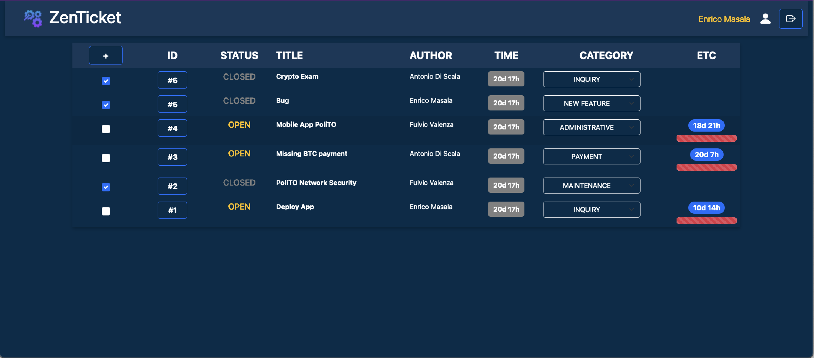

# Exam #1: "Ticketing System"
## Student: s323563 BRUNO RICCARDO

## React Client Application Routes

- Route `/`: tickets view
  - Route `/add`: nested add ticket form
- Route `/login`: login form

## API Server

### Tickets
- GET `/api/tickets`
  - Request parameters: none
  - Returns a list of Tickets in JSON format
- POST `/api/tickets`
  - Request parameters: none
  - Request body: JSON with state, title, author_id, category, submission_time and content
  - Returns the new ticket in JSON format
- PATCH `/api/tickets/open/:tid`
  - Request parameters: ticket id
  - Returns the update icket in JSON format
- PATCH `/api/tickets/close/:tid`
  - Request parameters: ticket id
  - Returns the update ticket in JSON format 
- PATCH `/api/tickets/:tid`
  - Request parameters: ticket_id
  - Request body: category
  - Returns the new updated tickets

### Blocks
- GET `/api/blocks/:tid`
  - Request parameters: ticket id
  - Returns a list of blocks (associated to ticket id) in JSON format
- POST `/api/blocks`
  - Body request: JSON with ticket_id, author_id, creation_time, content
  - Returns the new block in JSON format

### Authentication
- POST `/api/sessions`
  - Request body: username and password
  - Response body: user id, admin (boolean) and username
- GET `/api/sessions/current`
  - Request parameters: none
  - Response:
    - `200` and empty JSON body
    - `401` and {err: "No active session"}
- DELETE `/api/sessions/`
  - Request parameters: none
  - Response: empy JSON and `200` status code

### Token
- GET `/api/token`
  - Request parameters: none
  - Response: authLevel (boolean) and JWT token

## API Server2

- POST `/api/stats`
  - Request parameters: JWT token in header's `Bearer` and JSON body with a list of all tickets
  - Response: JSON body with a list of Objects containing ticket id and estimation

## Database Tables

- Table `users` - contains user_id (PK), admin, username, hash, salt
- Table `tickets` - contains ticket_id (PK), state, title, author_id (FK users.user_id), category, submission_time, content
- Table `blocks` - contains block_id (PK), ticket_id (FK tickets), author_id (FK users.user_id), creation_time, content

## Main React Components

- components of `Layout.jsx`: wrap all layout's
- `LoginForm` (in `Login.jsx`): renders the login form
- `NavBar` (in `NavBar.jsx`): renders the navbar used in common layout
- `TicketAdd` (in `TicketAdd.jsx`): renders the form and modal to add a new ticket
- `TicketsTable` and `TicketRow` (in `Tickets.jsx`): renders the table and rows with all features in home layout

## Screenshot

## Users Credentials

### ADMINS
- `cataldo_basile`, `passwd`
- `enrico_masala`, `passwd`

### USERS
- `antonio_di_scala`, `passwd`
- `antonio_lioy`, `passwd`
- `marco_mellia`, `passwd`
- `fulvio_valenza`, `passwd`
